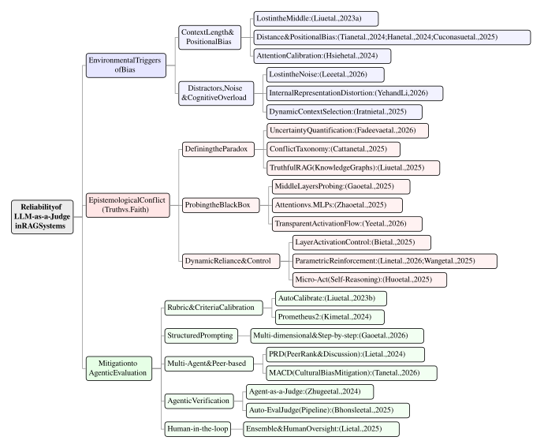

# Awesome-RAG-Evaluation

A curated list of papers, models, and resources investigating the reliability, biases, and mitigation strategies of Large Language Models as evaluators in Retrieval-Augmented Generation (RAG) systems. 

This repository corresponds to our survey paper: *The Illusion of Objectivity in RAG Evaluation: A Survey on the Reliability and Biases of LLM Judges*.

**Team Members:** Lynn Zhou, Deepmoy Hazra, Wei-Chen Huang

  

## Contents
- [Awesome-RAG-Evaluation](#awesome-rag-evaluation)
  - [Contents](#contents)
  - [Background \& Surveys](#background--surveys)
  - [Environmental Triggers of Bias](#environmental-triggers-of-bias)
  - [The Epistemological Conflict (Truthfulness vs. Faithfulness)](#the-epistemological-conflict-truthfulness-vs-faithfulness)
  - [Mitigation to Agentic Evaluation](#mitigation-to-agentic-evaluation)

## Background & Surveys

- **(JudgeSurvey)** *A Survey on LLM-as-a-Judge* `arXiv 2025`
  [[Paper]](https://arxiv.org/abs/2411.15594)

- **(TrustedRAG)** *Can LLMs be Trusted for Evaluating RAG Systems? A Survey of Methods and Datasets* `IEEE SDS 2025`
  [[Paper]](http://dx.doi.org/10.1109/sds66131.2025.00010)

- **(Gen2Judge)** *From Generation to Judgment: Opportunities and Challenges of LLM-as-a-judge* `arXiv 2025`
  [[Paper]](https://arxiv.org/abs/2411.16594)

## Environmental Triggers of Bias

- **(FairEval)** *Large Language Models are not Fair Evaluators* `arXiv 2023`
  [[Paper]](https://arxiv.org/abs/2305.17926)

- **(LostInTheMiddle)** *Lost in the Middle: How Language Models Use Long Contexts* `arXiv 2023`
  [[Paper]](https://arxiv.org/abs/2307.03172)

- **(FoundInTheMiddle)** *Found in the Middle: Calibrating Positional Attention Bias Improves Long Context Utilization* `arXiv 2024`
  [[Paper]](https://arxiv.org/abs/2406.16008)

- **(DistanceBias)** *Distance between Relevant Information Pieces Causes Bias in Long-Context LLMs* `arXiv 2024`
  [[Paper]](https://arxiv.org/abs/2410.14641)

- **(RAG-QA Arena)** *RAG-QA Arena: Evaluating Domain Robustness for Long-form Retrieval Augmented Question Answering* `arXiv 2024`
  [[Paper]](https://arxiv.org/abs/2407.13998)

- **(PosBias-RAG)** *Do RAG Systems Really Suffer From Positional Bias?* `arXiv 2025`
  [[Paper]](https://arxiv.org/abs/2505.15561)

- **(DynamicContext)** *Dynamic Context Selection for Retrieval-Augmented Generation: Mitigating Distractors and Positional Bias* `arXiv 2025`
  [[Paper]](https://arxiv.org/abs/2512.14313)

- **(LostInNoise)** *Lost in the Noise: How Reasoning Models Fail with Contextual Distractors* `arXiv 2026`
  [[Paper]](https://arxiv.org/abs/2601.07226)

- **(ContextRep)** *How Retrieved Context Shapes Internal Representations in RAG* `arXiv 2026`
  [[Paper]](https://arxiv.org/abs/2602.20091)

## The Epistemological Conflict (Truthfulness vs. Faithfulness)

- **(FActScore)** *FActScore: Fine-grained Atomic Evaluation of Factual Precision in Long Form Text Generation* `arXiv 2023`
  [[Paper]](https://arxiv.org/abs/2305.14251)

- **(FaithEval)** *FaithEval: Can Your Language Model Stay Faithful to Context, Even If "The Moon is Made of Marshmallows"* `arXiv 2025`
  [[Paper]](https://arxiv.org/abs/2410.03727)

- **(Param-Context)** *Parameters vs. Context: Fine-Grained Control of Knowledge Reliance in Language Models* `arXiv 2025`
  [[Paper]](https://arxiv.org/abs/2503.15888)

- **(AccommodateConflict)** *Accommodate Knowledge Conflicts in Retrieval-augmented LLMs: Towards Robust Response Generation in the Wild* `arXiv 2025`
  [[Paper]](https://arxiv.org/abs/2504.12982)

- **(TruthfulRAG)** *TruthfulRAG: Resolving Factual-level Conflicts in Retrieval-Augmented Generation with Knowledge Graphs* `arXiv 2025`
  [[Paper]](https://arxiv.org/abs/2511.10375)

- **(LatentConflict)** *Probing Latent Knowledge Conflict for Faithful Retrieval-Augmented Generation* `arXiv 2025`
  [[Paper]](https://arxiv.org/abs/2510.12460)

- **(KnowledgeRecon)** *Understanding Parametric and Contextual Knowledge Reconciliation within Large Language Models* `NeurIPS 2025`
  [[Paper]](https://openreview.net/forum?id=76cFMRgEzQ)

- **(DRAG)** *DRAGged into Conflicts: Detecting and Addressing Conflicting Sources in Search-Augmented LLMs* `arXiv 2025`
  [[Paper]](https://arxiv.org/abs/2506.08500)

- **(Micro-Act)** *Micro-Act: Mitigating Knowledge Conflict in LLM-based RAG via Actionable Self-Reasoning* `arXiv 2025`
  [[Paper]](https://arxiv.org/abs/2506.05278)

- **(TransparentConflict)** *Seeing through the Conflict: Transparent Knowledge Conflict Handling in Retrieval-Augmented Generation* `arXiv 2026`
  [[Paper]](https://arxiv.org/abs/2601.06842)

- **(Faith-UQ)** *Faithfulness-Aware Uncertainty Quantification for Fact-Checking the Output of Retrieval Augmented Generation* `arXiv 2026`
  [[Paper]](https://arxiv.org/abs/2505.21072)

- **(ResistInterference)** *Resisting Contextual Interference in RAG via Parametric-Knowledge Reinforcement* `arXiv 2026`
  [[Paper]](https://arxiv.org/abs/2506.05154)

## Mitigation to Agentic Evaluation

- **(PRD)** *PRD: Peer Rank and Discussion Improve Large Language Model based Evaluations* `arXiv 2024`
  [[Paper]](https://arxiv.org/abs/2307.02762)

- **(AutoCalibrate)** *Calibrating LLM-Based Evaluator* `arXiv 2023`
  [[Paper]](https://arxiv.org/abs/2309.13308)

- **(Prometheus 2)** *Prometheus 2: An Open Source Language Model Specialized in Evaluating Other Language Models* `arXiv 2024`
  [[Paper]](https://arxiv.org/abs/2405.01535)

- **(Agent-as-a-Judge)** *Agent-as-a-Judge: Evaluate Agents with Agents* `arXiv 2024`
  [[Paper]](https://arxiv.org/abs/2410.10934)

- **(Auto-Eval Judge)** *Auto-Eval Judge: Towards a General Agentic Framework for Task Completion Evaluation* `arXiv 2025`
  [[Paper]](https://arxiv.org/abs/2508.05508)

- **(AgentDebate)** *Can LLM Agents Really Debate? A Controlled Study of Multi-Agent Debate in Logical Reasoning* `arXiv 2025`
  [[Paper]](https://arxiv.org/abs/2511.07784)

- **(EvalMitigate)** *Evaluating and Mitigating LLM-as-a-judge Bias in Communication Systems* `arXiv 2026`
  [[Paper]](https://arxiv.org/abs/2510.12462)

- **(MACD)** *Mitigating Cultural Bias in LLMs via Multi-Agent Cultural Debate* `arXiv 2026`
  [[Paper]](https://arxiv.org/abs/2601.12091)

- **(Tool-Memory)** *Investigating Tool-Memory Conflicts in Tool-Augmented LLMs* `arXiv 2026`
  [[Paper]](https://arxiv.org/abs/2601.09760)

- **(Agent-Judge-Survey)** *Agent-as-a-Judge* `arXiv 2026`
  [[Paper]](https://arxiv.org/abs/2601.05111)